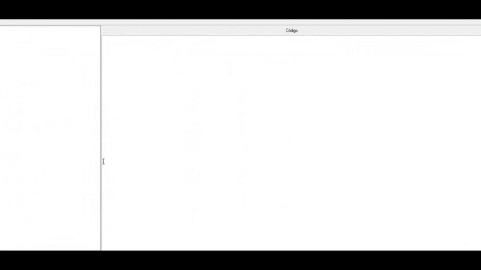

# Search program text in triggers and stored procedures in firebird database using Delphi Seattle

## Summary
This program allows the search of any text showing in red the point found

## Database
The routine was developed for a firebird database, but it is possible to easily modify it for other databases by changing only the lookup tables and the connection

## Using

